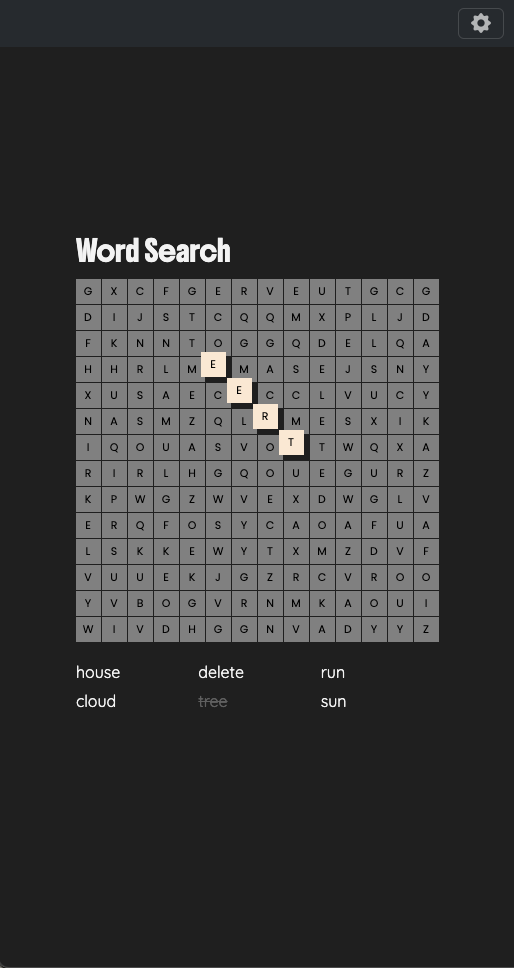
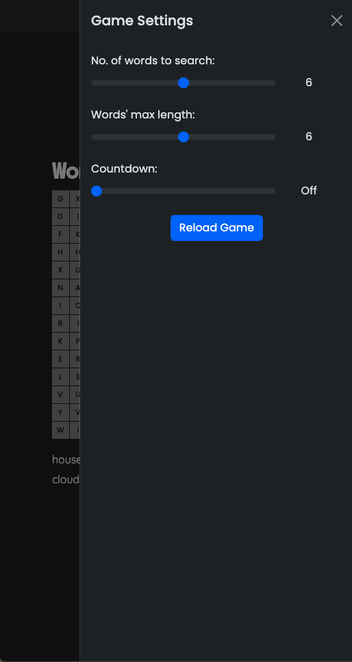
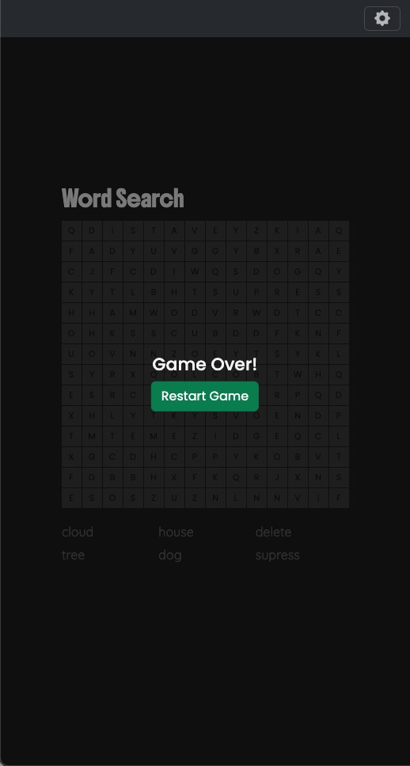

# Word Search Game

A web-based word search puzzle game built with JavaScript. This project allows users to customize the game's difficulty by adjusting the number of words, the maximum word length, and the presence of a countdown timer.

## Table of Contents

-   [Features](#features)
-   [How to Play](#how-to-play)
-   [Installation and Setup](#installation-and-setup)
-   [Project Structure](#project-structure)
-   [Technologies Used](#technologies-used)
-   [Customization](#customization)
-   [Future Enhancements](#future-enhancements)
-   [Contributing](#contributing)
-   [License](#license)
-   [Screenshots](#screenshots)
-   [Demo](#demo)
-   [Acknowledgements](#acknowledgements)

## Features

-   **Customizable Grid:** The game grid size is fixed at 14x14.
-   **Adjustable Word Count:** Players can choose the number of words to find (between 2 and 10).
-   **Word Length Control:** Set the maximum length of the words in the puzzle.
-   **Countdown Timer:** Option to play with a countdown timer (up to 10 minutes).
-   **Word List:** A list of words to find is displayed below the grid.
-   **Highlighting:** Found words are highlighted in the grid.
-   **Restart Option:** Easily restart the game with new settings.
-   **Responsive Design:** The game is designed to be played on various screen sizes.
-   **Error Handling:** Robust error handling for JSON data loading and invalid settings.
- **Tracing:** Trace the path of the word by clicking the start and end squares.
- **Hover Scope:** When tracing, the surrounding squares will be highlighted.
- **Escape Key:** Press the escape key to reset the tracing.
- **Click Outside:** Click outside the grid to reset the tracing.
- **Pause/Resume:** The countdown timer will pause when the user switches tabs/windows.

## How to Play

1.  **Customize Settings:**
    -   Click the settings icon (usually a gear or cogwheel).
    -   Adjust the number of words, maximum word length, and countdown time.
    -   Click "Reload" to apply the settings.
2.  **Find the Words:**
    -   Look at the word list below the grid.
    -   Find the words hidden in the grid.
    -   Click on the start and end squares of a word to select it.
3.  **Complete the Game:**
    -   Once all words are found, the game will end.
    -   Click "Restart" to play again.
4. **Tracing**
    - Click on the start square of the word.
    - Click on the end square of the word.
    - If the word is correct, it will be highlighted.
5. **Reset Tracing**
    - Press the escape key to reset the tracing.
    - Click outside the grid to reset the tracing.

## Installation and Setup

1.  **Clone the Repository:**
    ```bash
    git clone https://github.com/MgHt00/word-search.git
    ```
2.  **Navigate to the Directory:**
    ```bash
    cd word-search
    ```
3.  **Open `index.html`:**
    -   Open the `index.html` file in your web browser.

## Project Structure
```
word-search/ 
├── src/ 
│ ├── js/ 
│ │ ├── components/ # UI components and their logic 
│ │ │ ├── countdownManager.js 
│ │ │ ├── fillingManager.js 
│ │ │ ├── inputManager.js 
│ │ │ ├── interactionManager.js 
│ │ │ ├── layoutManager.js 
│ │ │ ├── loadingManager.js 
│ │ │ ├── scopeFinder.js 
│ │ ├── constants/ # Constant values (file paths, selectors, etc.) 
│ │ │ ├── cssClassNames.js 
│ │ │ └── filePaths.js 
│ │ │ └── selectors.js 
│ │ ├── services/ # Core game logic and data management 
│ │ │ ├── globalDataManager.js 
│ │ │ ├── globals.js 
│ │ │ └── wordManager.js 
│ │ └── main.js # Entry point of the application 
│ └── css/ 
│ └── style.css # Stylesheets 
├── index.html # Main HTML file 
├── README.md # Project documentation 
└── ...
```

**Key Folders and Files:**

-   **`src/js/components/`:** Contains the JavaScript files for managing different parts of the game's UI and interactions:
    -   `countdownManager.js`: Manages the countdown timer.
    -   `fillingManager.js`: Handles the placement of words in the grid.
    -   `inputManager.js`: Manages user input for game settings.
    -   `interactionManager.js`: Handles user interactions with the grid.
    -   `layoutManager.js`: Generates the grid layout.
    -   `loadingManager.js`: Manages the loading and restart processes.
    -   `scopeFinder.js`: Finds the surrounding squares of a clicked square.
    - `_tempTimer.js`: A temporary timer file.
-   **`src/js/constants/`:** Contains constant values used throughout the project:
    -   `cssClassNames.js`: CSS class names.
    -   `filePaths.js`: File paths for data.
    -   `selectors.js`: Selectors for DOM elements.
-   **`src/js/services/`:** Contains the core game logic and data management:
    -   `globalDataManager.js`: Manages global game data and settings.
    -   `globals.js`: Defines global variables and data structures.
    -   `wordManager.js`: Handles word data loading and processing.
-   **`src/js/main.js`:** The entry point of the application.
-   **`src/css/style.css`:** The stylesheet for the game.
-   **`index.html`:** The main HTML file for the game.
- **`README.md`:** The project documentation.

## Technologies Used

-   **HTML5:** For structuring the web page.
-   **CSS3:** For styling the game.
-   **JavaScript (ES6+):** For game logic, interactions, and data management.
- **Bootstrap:** For the offcanvas component.

## Customization

-   **Word Data:**
    -   Modify the `WORDS_DATA_PATH` in `src/js/constants/filePaths.js` to use a different JSON file with your own word list.
    -   The JSON file should be structured as an object where keys are word lengths and values are arrays of words of that length.
-   **Game Settings:**
    -   Change the default values in `src/js/services/globals.js` to adjust the initial game settings (word count, max word length, countdown time, grid size).
-   **Styling:**
    -   Modify `src/css/style.css` to change the game's appearance.
- **Debug Mode:**
    - Change the `debugMode` in `src/js/services/globals.js` to `true` to enable debug mode.

## Future Enhancements

-   **Difficulty Levels:** Implement different difficulty levels (e.g., easy, medium, hard) with varying grid sizes and word counts.
-   **Theming:** Add the ability to change the game's theme.
-   **Score Tracking:** Keep track of the player's score and best times.
-   **Mobile Optimization:** Further optimize the game for mobile devices.
-   **Word Categories:** Allow the user to select the word categories.
-   **Multiplayer:** Allow the user to play with other players.

## Contributing

Contributions are welcome! If you'd like to contribute to this project, please follow these steps:

1.  Fork the repository.
2.  Create a new branch for your feature or bug fix.
3.  Make your changes and commit them.
4.  Push your changes to your fork.
5.  Submit a pull request.

## License

This project is licensed under the MIT License.

## Screenshots

## Screenshots

Here are some screenshots of the game:

### Main Game Screen


### Settings Menu


### Game Over



## Demo

https://mght00.github.io/word-search/

## Acknowledgements

This project benefited greatly from the assistance of AI tools. I would like to extend my thanks to both ChatGPT and Gemini for their creative suggestions, problem-solving capabilities, and code refinement. Their contributions were instrumental in making this project what it is today.
